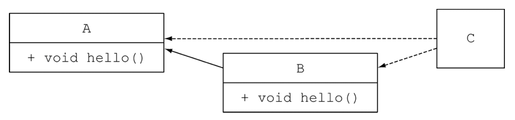
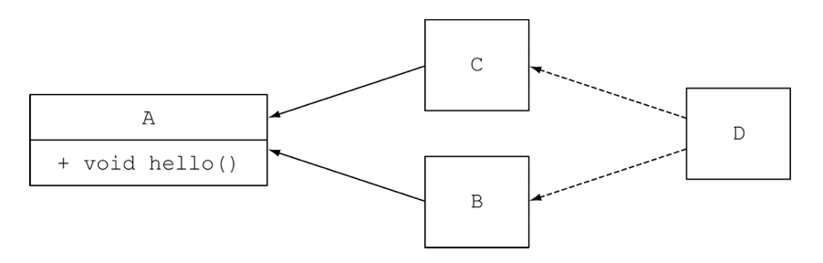
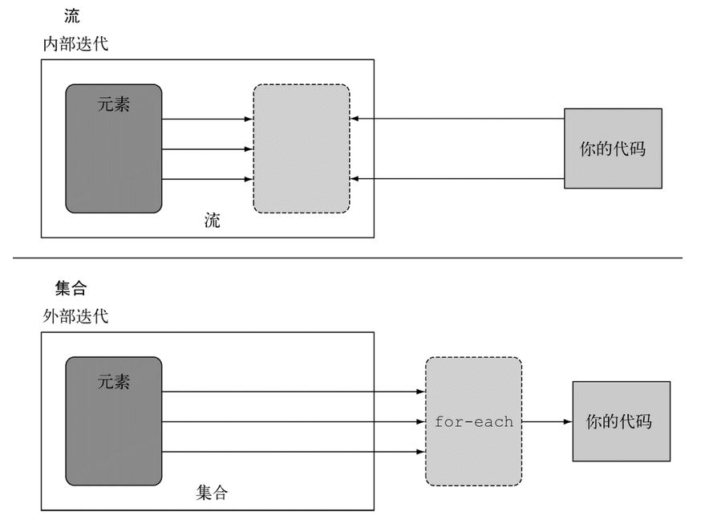

# Java 8
### Lambda表达式
1. 什么是Lambda表达式： 在Lisp、Python和Ruby等编程语言中，lambda是一个用于表示匿名函数或闭包的运算符，它遵循lambda演算的用法
   * Java Lambda表达式是⼀种匿名函数;它是没有声明的方法，即没有访问修饰符、返回值声明和名字

2. 为什么需要lambda 表达式
   * 在java 中，无法将函数作为参数传递给一个方法，也无法声明返回一个函数的方法
   * 在 Javascript 中，函数参数是⼀个函数，返回值是另一个函数的情况是非常常见的，javascript就是一门典型的函数式的编程语言
      
3. java 的匿名内部类
   * 在java 8 之前，为了实现 向一个函数传递一个行为， 一般会采用匿名内部类的这种方式来实现。
   ``` java 
   protected void onCreate(Bundle savedInstanceState) { 
      super.onCreate(savedInstanceState); 
      setContentView(R.layout.activity_main);
      Button firstButton = (Button) findViewById(R.id.first);
      Button secondButton = (Button) findViewById(R.id.second);
      firstButton.setOnClickListener(new View.OnClickListener() {
      @Override
      public void onClick(View v) {
         goToFirstActivity(); }
      });
      secondButton.setOnClickListener(new View.OnClickListener() {
         @Override
         public void onClick(View v) {
            goToSecondActivity(); }
         });
   }
   ```
   * Lambda表达式 和 匿名内部类的比较参考例子`SwingTest` 
4. lambda表达式的基本结构，下面是lambda 表达式的最基本的结构
   1. Java Lambda结构 ⼀个 Lambda 表达式可以有零个或多个参数
   2. 参数的类型既可以明确声明，也可以根据上下文来推断。例如:(int a)与(a)效果相同 
   3. 有参数需包含在圆括号内，参数之间⽤用逗号相 隔。例例如:(a, b) 或 (int a, int b) 或 (String a, int b, float c) 空圆括号代表参数集为空。例如:() -> 42
   4. 当只有⼀个参数，且其类型可推导时，圆括号（）可省 略。例如：a -> return a*a 
   5. Lambda 表达式的主体可包含零条或多条语句 
   6. 如果 Lambda 表达式的主体只有⼀条语句，花括号{}可 省略。匿名函数的返回类型与该主体表达式⼀致 
   7. 如果 Lambda 表达式的主体包含⼀条以上语句，则表达 式必须包含在花括号{}中（形成代码块）。匿名函数的返 回类型与代码块的返回类型⼀致，若没有返回则为空
   8. 具体说明
      * Java Lambda基本语法 Java中的Lambda表达式基本语法
        * (argument) -> { body} 比如说
              * (arg1, arg2...) -> { body }
              * (type1 arg1, type2 arg2...) -> { body }

      * Java Lambda示例例
          * Lambda示例例说明
            * (int a, int b) -> { return a + b; }
            * () -> System.out.println("Hello World"); 
            * (String s) -> { System.out.println(s); }
            * () -> 42
            * () -> { return 3.1415 }; 
       
      * 演示使用Lambda表达式 遍历一个集合参考 `LoopTest`
5. lambda表达式的作用
   * Lambda表达式为Java添加了缺失的函数式编程特性，使我们能将函数当做⼀等公⺠看待
   * 在将函数作为⼀等公⺠的语⾔中，Lambda表达式 的类型是函数。
     * 但在Java中，Lambda表达式是对象，他们必须依附于类特别的对象类型函数式接⼝(functional interface)
   * 传递行为，不仅仅是值
      * 提升抽象的层次
      * API 重用性更好， 更加灵活
### 函数式接口
1. 一个接口被@FunctionalInterface是函数式接口
   * java.lang.FunctionalInterface 
   * 标识所声明的接⼝为函数式接⼝ 
   * 如果不满⾜函数式接⼝的要求，则编译器报错 
   * 并⾮必须，但凡满⾜函数式接⼝条件的接⼝， 编译器均将其看作是函数式接⼝，即便没有添 加FunctionalInterface注解亦如此
   
2. 一个接口只有一个精确的抽象方法（java 8  开始， 接口可以有实现方法， 但是实现方法必须以 default开头）
   1. default方法不计入抽象方法计数

   2. 覆盖了Object类的抽象方法，也不计入到抽象方法数。

3. 满足2的定义的接口，即使没有被@FunctionalInterface修饰，那么他也是函数式接口。

4. 一个接口被@FunctionalInterface修饰，那么他一定会满足2的定义，否则编译报错。

5. 函数式接口的实例，可以通过lambda表达式，方法引用，构造方法引用来创建

6. FunctionalInterface 的例子参考`FunctionalInterFaceDefinition`

7. 如何通过自定义的FunctionalInterface 完成Lambda 表达式的使用参考`FunctionalInterfaceTest`
### 默认方法
1. jdk 8 为接口追加了可以实现的方法。 这种方法在接口中使用default 修饰符 修饰方法 参考事例`MyClass`，目的是为了实现向后兼容。
   由于java 8 追加了大量函数式方法，为了实现这些功能而不影响Java8以前的版本，所以追加了default method
2. 当一个类同时实现两个接口。 当这两个接口有两个相同的方法名的时候， 究竟使用哪一个呢？ 参考例子`DuplicatedImplementsDemo`
    * 对于这种问题， 需要显示的调用 `目标父接口.super.默认方法名` 或者直接在子类中自己实现该方法
3. 如何处理菱形继承问题。类似与C++ 多重继承问题。java 的解决方案
    
    
   * 首先，类或父类中显式声明的方法，其优先级高于所有的默认方法。 
   * 如果用第一条无法判断，方法签名又没有区别，那么选择提供最具体实现的默认方法的接口。
   * 最后，如果冲突依旧无法解决，你就只能在你的类中覆盖该默认方法，显式地指定在你的类中使用哪一个接口中的方法。
### 方法引用
1. 方法引用是lambda 表达是的一个语法糖，在很多时候， 如果一个lambda 表达式能够实现的功能，如果使用一个方法能够实现， 
   那么就可以 使用方法引用的方式来实现，使方代码更加清晰简洁。 参考例子 `MethodReferenceDemo`
    ``` Java
    // lambda 表达是的方式
    strs.forEach( item -> System.out.println(item));
    // 方法引用的方式
    strs.forEach(System.out::println);
    ```
2. 可以将方法引用看作是一个 【函数指针】，下面是方法引用的分类（一共四类）参考例子`MethodReferenceDemo`
    1. 类名::静态方法名 
    2. 对象::方法名
    3. 类名::实例方法名
    4. 构造方法引用: 类名::new 

### 常用的FunctionalInterface
#### Consumer接口
1. 顾名思义， Consumer 就是一个消费接口， 接受参数，并消费掉，不返回任何结果。
2. 最常用的例子就是`Iterable#foreach`

#### Function 接口
1. 接收一个参数，并返回一个结果，与数学的定义相同 
   * 参考例子`FunctionTest`
2. 包含两个default方法和一个静态方法
   ``` java
    default <V> Function<V, R> compose(Function<? super V, ? extends T> before) {
           Objects.requireNonNull(before);
           return (V v) -> apply(before.apply(v));
       }
   default <V> Function<T, V> andThen(Function<? super R, ? extends V> after) {
           Objects.requireNonNull(after);
           return (T t) -> after.apply(apply(t));
       }
   static <T> Function<T, T> identity() {
           return t -> t;
       }
   ```
3. 高阶函数
   * 如果一个函数接收一个函数作为参数，或者返回一个参数当作返回值那个这个函数就是一个高阶函
      * compose  参考例子`FunctionTest`
         1. y=f(x)  : 相当于 Function 接口中的 apply 方法
         2. x=g(m) ： 相当于  Function 接口中 compose 方法接受的参数
         3. y = f(g(m))  最后的执行结果
      * andThen  参考例子`FunctionTest`
         1. y=f(x)  ：相当于 Function 接口中的 apply 方法
         2. m=g(y) ：相当于  Function 接口中 andThen 方法接受的参数 
         3. m=g(f(x)) 最后的执行结果

#### BiFunction
* 一个函数有两个输入一个输出，它是`Function`，他是function 接口的一个特化形式 (参考 `BiFunctionDemo`)
#### Predicate 
* 意思是断言（谓词），接受一个参数， 返回一个布尔值 参考`PredicateDemo`

* 包含的几个重要的default 方法 ,参考`PredicateDefaultMethodDemo`
    ``` java
    default Predicate<T> and(Predicate<? super T> other) {
        Objects.requireNonNull(other);
        return (t) -> test(t) && other.test(t);
    }
     default Predicate<T> negate() {
        return (t) -> !test(t);
    }
    default Predicate<T> or(Predicate<? super T> other) {
        Objects.requireNonNull(other);
        return (t) -> test(t) || other.test(t);
    }
    ```
#### Supplier
* 表示一个结果的供应者， 不接收参数， 返回一个对象 。参考demo `SupplierDemo`
    * 在实际开发中，经常备用来当作工厂
#### Optional
1. Optional 是一个容器，里面可能包含了一个或这0个元素。如果调用`isPresent()`方法返回`true`，那么调用`get()`方法将返回Optional里面的值， 参考例子`OptionalDemo`
2. Optional根据里面是否存在值还提供了一些额外的方法，如`orElse` 和`ifPresent`。 在真正的开发应用中， 这两个方法会经常用到
3. 使用`Optional` 进行构造的的时候可以使用`of()` 方法和`ofNullable()`  ，但是使用`of()`进行构造的时候要保证参数是非空的，
   否则会抛出NullPointException，实际开发中根据需要，如果取得参数中一定有值，可以使用`of()` 反之用`ofNullable()`构造
   ``` java
   Optional<String> optional = Optional.ofNullable("Hello");
    Optional<String> optional2 = Optional.of("Hello")
   ```
4. Optional 的目标是为了解决空指针异常， java8 之前的方式和java8 的方式的比较参考例子`OptionalCompareDemo`
    * 在java 8 之前 写程序需要向下面这样来防止空指针异常 
      ``` java
      if(null != person){
        Address address = person.getAddress();
        if(null != address){
            ......
        }
      }  
      ```
    * 使用Java 8 的写法
        1. 使用isPresent 和 get方法配合使用， 这种用法和java 8 之前的写法没有区别，所以在生产中基本不会使用这种方法
        ``` java
        if (optional.isPresent()){
            System.out.println(optional.get());
        }
        ```
        2. Optional 推荐使用函数是的编程风格，如下, 这也是在实际开发中经常使用的方法
            1. 提供默认返回值的写法有下面java代码中的两种写法
            ``` java
            // 返回默认值
            System.out.println(optional.orElse("default value"));
            // 使用一个Supplier 当作参数，返回Supplier 提供的值
            optional.orElseGet(() -> "default value");
            ```
            2. 使用`ifPreset`的写法. 如果Optional里面有值， 执行 ifPresent里面的`Consumer` 参数
            ``` java 
                optional.ifPresent(t -> System.out.println(t));
            ```
5. Optional 还有一些方法，例如`Stream`，`map`，`flatMap`与后面介绍的Stream方式相同。 小例子`OptionalOtherUserDemo`。具体使用的方法参考下面的Stream 介绍

### Stream 流
1. Stream 的概念： stream是一些元素，支持一系列串行或者并行操作 。(1. 不是java IO 中的流 2. 可以把java 8中的流想象成linux 中的管道（pipeline），一个操作的结果是下一个操作的数据源) 例
    ``` Java
    int sum = widgets.stream()
                  .filter(w -> w.getColor() == RED)
                  .mapToInt(w -> w.getWeight())
                  .sum();
    ```
   * 流有哪些特点： 它允许以声明性方式处理数据集合（通过查询语句来表达，而不是临时编写一个实现）。就现在来说，可以把它们看成遍历数据集的高级迭代器。
     此外，流还可以透明地并行处理，你无需写任何多线程代码
        1. 流不存储值， 通过管道的方式获取值
        2. 本质函数式的，对流的操作会产生一个结果，不过并不会修改底层的数据源，集合可以作为流的底层数据源
        3. 延迟查找，很多流操作（过滤，映射，排序）都是延迟的， 只有执行了终止操作，这些操作才会执行。
     
   * Java8 以前的方式 处理集合 与java 8使用流的方式处理集合进行比较
        1. java8 以前的版本
            ``` java
            List<Dish>lowCaloricDishes=newArrayList<>();
            for(Dishd:menu){
                if(d.getCalories()<400){//←─用累加器筛选元素
                    lowCaloricDishes.add(d);
                }
            }
            Collections.sort(lowCaloricDishes,
                new Comparator<Dish>(){//←─用匿名类对菜肴排序
                    public int compare(Dishd1,Dishd2){
                        returnInteger.compare(d1.getCalories(),d2.getCalories());
                }
            });
            List<String> lowCaloricDishesName=new ArrayList<>();
            for(Dish d:lowCaloricDishes){
                lowCaloricDishesName.add(d.getName());//←─处理排序后的菜名列表
            }
            ```
        2. java 8 的版本
           ``` java
            List<String> lowCaloricDishesName= menu.stream()
                                                //parallelStream() //   轻松实现并发版本  

                        .filter(d ->d.getCalories()<400)//←─选出400卡路里以下的菜肴
                        .sorted(comparing(Dish::getCalories))//←─按照卡路里排序
                        .map(Dish::getName)//←─提取菜肴的名称
                        .collect(toList());//←─将所有名称保存在List中

            ```
2. 流的组成
    1. 数据源（和不是DB的数据源的意思，指的是一些数据的集合）
    2. 零个或多个中间操作
    3. 终止操作
3. 流操作的分类
    1. 惰性求值 ： 对应流的组成中的0个或多个中间操作。
    2. 及早求值 ： 对应的是终止操作。
    * 例如 `stream.xxx().yyyy().count()` 其中`xxx().yyyy()` 就是惰性求值，`count()`就是及早求值
    * 在终止操作执行（）之前， 这个流中的各个中间操作是不会执行的，所以这些中间操作是惰性求值。 只有当终止操作执行， 整个流才会执行。
       
#### 流的创建方式
1. 事例`CreateStreamDemo`中列出了集中常见的创建流的方式
2. IntStream (LongStream, DoubleStream)的创建方式
    1. 由于原生类型 在进行拆箱和装箱操作的时候，会有很大的性能修好。所以java8的设计这专门设计了IntStream (LongStream, DoubleStream)
    2. 除了Stream的集中创建方式之外， IntStream 还有自己的创建方式，参考事例`CreateIntStreamDemo`
#### 流的特点
流操作有两个重要的特点。
1. 流水线——很多流操作本身会返回一个流，这样多个操作就可以链接起来，形成一个大的流水线。
2. 流水线的操作可以看作对数据源进行数据库式查询。内部迭代——与使用迭代器显式迭代的集合不同，流的迭代操作是在背后进行的。
    * 内部迭代与外部迭代 参考下图
    
#### 流的基本操作

| 操作类型  | 类型             | 返回类型    | 使用的类型/函数式接口 | 函数描述符   |
| --------- | ---------------- | ----------- | --------------------- | ------------ |
| filter    | 中间             | Stream<T>   | Predicate<T>          | T->boolean   |
| distinct  | 中间(有状态无界) | Stream<T>   |                       |              |
| skip      | 中间(有状态有界) | Stream<T>   | long                  |              |
| limit     | 中间(有状态有界) | Stream<T>   | long                  |              |
| map       | 中间             | Stream<R>   | Function<T,R>         | T->R         |
| flatMap   | 中间             | Stream<R>   | Function<T,Stream<R>> | T->Stream<R> |
| sorted    | 中间(有状态无界) | Stream<T>   | Comparator<T>         | (T,T)->int   |
| anyMatch  | 终端             | boolean     | Predicate<T>          | T->boolean   |
| noneMatch | 终端             | boolean     | Predicate<T>          | T->boolean   |
| allMatch  | 终端             | boolean     | Predicate<T>          | T->boolean   |
| findAny   | 终端             | Optional<T> |                       |              |
| findFirst | 终端             | Optional<T> |                       |              |
| forEach   | 终端             | void        | Consumer<T>           | T->void      |
| collect   | 终端             | R           | Collector<T,A,R>      |              |
| reduce    | 终端(有状态有界) | Optional<T> | BinaryOperator<T>     | (T,T)->T     |
| count     | 终端             | long        |                       |              |

* `map` 映射操作， 它会接受一个函数作为参数。这个函数会被应用到每个元素上，并将其映射成一个新的元素
    * 参考例子`MappingDemo`
      1. 将一组String类型的词组的首字母转换为大写
      2. 求出每一个数字的平方
* `flatMap` 流的扁平化映射，，flatmap方法把一个流中的每个值都换成另一个流，然后把所有的流连接起来成为一个流。(概念比较难理解，可以想象成把一个2维数组变为一个以为数组，在开发中会遇到flatMap的实际应用，需要掌握)
    * 参考例子`FlatMapDemo`
    
* `findFirst` 从Stream中取得第一个元素 
    * 参考例子`FindFirstDemo`

* `filter` 从Stream中过滤掉不满足条件的元素
    * 参考例子`FilterDemo`
    


    
